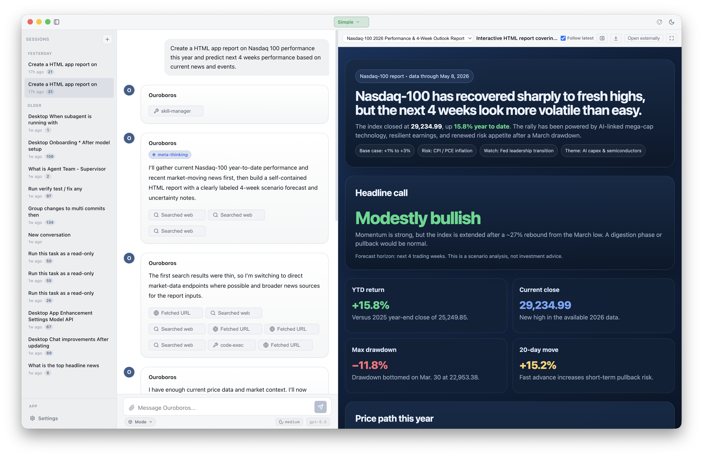
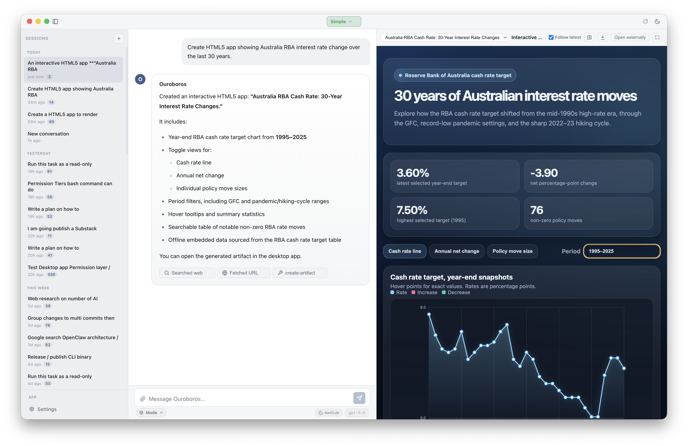
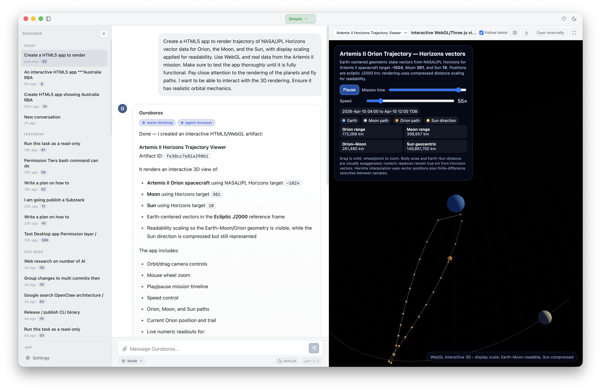
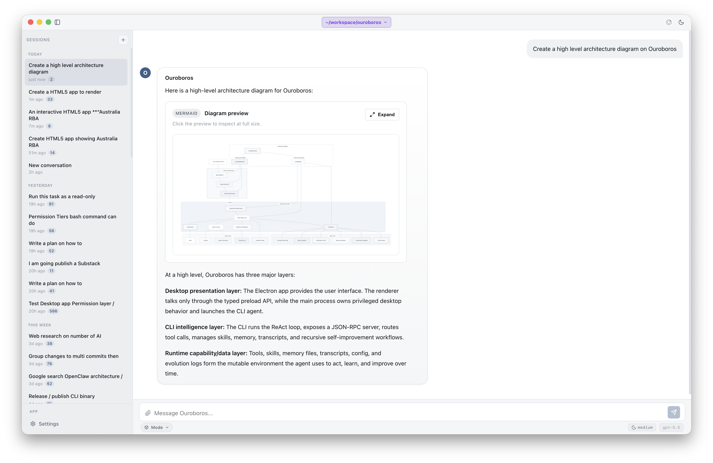

# Ouroboros - A local first Self-Improving AI Agent (Research Preview)

Ouroboros is a Bun/TypeScript monorepo for a Recursive Self Improving (RSI) AI agent.
It includes a CLI agent, an Electron desktop app, shared protocol/types, runtime
Agent Skills, structured memory, HTML artifacts, subagents, team workflows, MCP,
and a JSON-RPC bridge between the CLI and desktop.

The CLI owns agent intelligence. The desktop app is a presentation layer that
spawns the CLI in JSON-RPC mode and talks to it over NDJSON on stdio.

## Screenshots

A few snapshots of the desktop app showing what it produces in real sessions.
Click any image for the full-resolution view.

### HTML5 app artifact - Nasdaq 100 performance and prediction

Ouroboros generated a self-contained interactive dashboard from a chat prompt
and previewed it inline next to the conversation.

<a href="docs/screenshots/Ouroboros-HTML5-Nasdaq-full.png">
  
</a>

Prompt to try: Create a HTML app report on Nasdaq 100 performance this year and predict next 4 weeks performance based on current news and events.

### HTML5 app artifact - 30 years of Australian interest rate moves

<a href="docs/screenshots/Ouroboros-HTML5-AU-interest-rate-full.png">
  
</a>

Prompt to try: Create HTML5 app showing Australian RBA interest rate change over the last 30 years.

### HTML5 app artifact - Artemis II Orion trajectory in 3D

The agent rendered NASA/JPL Horizons vector data for Orion, the Moon, and the
Sun as an embedded WebGL/Three.js artifact, scaled for readability.

<a href="docs/screenshots/Ouroboros-HTML5-Orion-full.png">
  
</a>

Prompt to try: Create a HTML5 app to render trajectory of NASA/JPL Horizons vector data for Orion, the Moon, and the Sun, with display scaling applied for readability. Use WebGL and real data from the Artemis I! mission. Make sure to test the app thoroughly until it is fully functional. Pay close attention to the rendering of the planets and fly paths. I want to be able to interact with the 3D rendering. Ensure it has realistic orbital mechanics.

### Architecture diagram preview

When asked for a high-level Ouroboros architecture diagram, the agent produced
a Mermaid diagram artifact with a fullscreen preview and zoom controls.

<a href="docs/screenshots/Ouroboros-diagram-full.png">
  
</a>

Prompt to try: Create a high level architecture diagram.

## Installation

### macOS Beta Release Build

Ouroboros currently ships as a macOS beta release build. Download the latest
macOS beta from the latest release:

<p>
  <a href="https://github.com/secondorderai/ouroboros/releases">
    
  </a>
</p>

Open the downloaded `.dmg`, then move `Ouroboros.app` to `Applications` if
macOS asks you to.

_Beta warning: This app can connect to model providers, read and write files in
workspaces you select, execute tool calls after approval, and preserve local
memory. Use it only with projects and credentials you are comfortable testing
with, review permission prompts carefully, and keep backups of important work._

## Quick Start For Local Development

### Prerequisites

- [Bun](https://bun.sh) v1.3+
- One configured model provider:
  - `OPENAI_API_KEY` for OpenAI, the default provider (`gpt-5.5`)
  - `ANTHROPIC_API_KEY` for Anthropic
  - an OpenAI-compatible endpoint plus `OUROBOROS_OPENAI_COMPATIBLE_API_KEY`
  - a ChatGPT Plus/Pro login for the `openai-chatgpt` provider

```bash
bun install
```

### CLI

```bash
# From the repo root
bun run dev

# Or from the package
cd packages/cli
bun run dev
```

Build and run the compiled binary:

```bash
cd packages/cli
bun run build

./dist/ouroboros
./dist/ouroboros -m "Summarize this repo"
./dist/ouroboros --model openai/gpt-5.5 --reasoning-effort medium --plan
echo "Explain this" | ./dist/ouroboros
./dist/ouroboros --json-rpc
./dist/ouroboros auth login --provider openai-chatgpt
./dist/ouroboros dream --mode consolidate-only
```

### Desktop App

```bash
cd packages/desktop
bun run dev
```

See the [Desktop How-To Guides](docs/desktop/how-to/README.md) for step-by-step
usage of desktop app features.

Build distributables:

```bash
cd packages/desktop
bun run build        # unpacked current-platform package
bun run build:vite   # Vite/Electron build only
bun run build:mac    # macOS package
bun run build:win    # Windows package
bun run build:dist   # distributable packages without publish
bun run release      # publish through electron-builder config
```

## Current Feature Surface

- **Agent loop:** provider-agnostic ReAct loop with streaming, parallel tool
  calls, tool-result observation, cancellation, steering, Plan mode, and
  context usage events.
- **Desktop bridge:** Electron main process spawns the CLI with `--json-rpc`;
  renderer calls typed preload APIs through a policy gate and receives protocol
  notifications.
- **Desktop shell:** onboarding, Simple and Workspace modes, sessions, command
  palette, settings, update banner, file/image attachments, steering, status
  badges, and Ask User dialogs.
- **Agent Skills:** Agent Skills `SKILL.md` discovery, activation,
  slash invocation (`/<skill> prompt`), approval-aware activation, built-in
  desktop skills, user-global skill roots, workspace skill directories, and
  `disabledSkills` filtering.
- **Built-in Meta Thinking skill:** `meta-thinking` applies a compact
  SecondOrder workflow for structured planning, tradeoff analysis,
  troubleshooting under uncertainty, and concise surfacing of confidence,
  limitations, and context gaps.
- **Memory and Recursive Self-Improvement (RSI):** durable `MEMORY.md`, observations, checkpoints, daily
  working memory, transcripts, reflection, crystallization, dream
  consolidation, evolution logging, and desktop RSI history/checkpoint views.
- **Artifacts:** `create-artifact` writes sandboxed self-contained HTML
  artifacts under session storage; desktop lists, previews, follows latest,
  hides/shows, fullscreen-toggles, downloads, opens artifacts safely, and
  renders enhanced Mermaid diagrams.
- **Modes:** mode tools and JSON-RPC methods support Plan mode state,
  submission, entry, and exit.
- **Subagents and teams:** configurable agent definitions, read-only
  exploration/review subagents, restricted test agent policy, structured
  subagent results, subagent lifecycle notifications, permission leases,
  worktree-worker hooks, team graph/workflow runtime, debate/review workflow
  surfaces, and team advisor/reputation tools.
- **Approvals:** permission-tier model, approval requests, approval queue,
  permission lease updates, and worker diff approval flow.
- **MCP:** local and remote MCP server config, runtime status methods,
  connection notifications, and approval policy for MCP tool calls.
- **Auth:** API-key providers plus `openai-chatgpt` OAuth login stored outside
  project config in `~/.ouroboros/auth.json`.

## Architecture


Ouroboros is split into four primary layers:

- `packages/cli`: core agent, CLI entrypoint, tools, JSON-RPC server, memory,
  RSI, MCP, subagents, teams, artifacts, and Bun tests.
- `packages/desktop`: Electron 41 + React 19 presentation layer. Main process
  owns native services and the CLI child process; preload exposes typed APIs;
  renderer owns chat, settings, artifacts, RSI, approvals, and team graph UI.
- `packages/shared`: protocol/domain/result types consumed by CLI and desktop.
- Runtime data at the repo root: `skills/`, `memory/`, `docs/`, and `tickets/`.

The JSON-RPC bridge currently exposes these method groups:

- `agent/*`: run, cancel, steer
- `session/*`: list, load, new, delete, rename
- `config/*`: get, set, API key storage, connection test
- `auth/*`: ChatGPT subscription login lifecycle
- `skills/*`: list and get instructions
- `rsi/*`, `evolution/*`: dream, status, history, checkpoint, stats
- `approval/*`, `askUser/*`: approval queue and interactive prompts
- `workspace/*`: set and clear workspace roots
- `team/*`: create, workflow creation, start/cancel/cleanup, task assignment,
  team messaging
- `mode/*`: mode state, enter, exit, plan submission
- `artifacts/*`: list and read session artifacts
- `mcp/*`: list and restart configured MCP servers

Notifications cover streamed text, context usage, tool calls, turn completion,
errors, steering injection/orphaning, turn aborts, thinking/status updates,
subagent lifecycle, permission leases, team graph updates, memory updates, skill
activation, approval and Ask User requests, RSI events/runtime, mode lifecycle,
artifact creation, and MCP server lifecycle.

## What Ouroboros can and cannot do

Ouroboros can:

- Run an AI coding agent from the CLI or desktop app.
- Stream model output, call tools, ask for approvals, and keep session state.
- Work with local files, shell commands, MCP servers, Agent Skills, artifacts,
  memory, subagents, and team workflows.
- Use provider API keys or the `openai-chatgpt` provider to connect to a model.
- Launch the desktop app as a presentation layer over the CLI JSON-RPC runtime.

Ouroboros cannot:

- Guarantee correct, safe, or useful agent output without human review.
- Modify protected system areas or external services unless you configure
  credentials, workspace access, tools, and permissions for that work.
- Replace source control, tests, code review, backups, or operational safeguards.
- Promise stable behavior across beta releases, especially for desktop
  packaging, update behavior, RSI, memory, subagents, and team workflows.

## Known Limitations

- The release app is beta software and may contain workflow, packaging, update,
  or data-retention bugs.
- macOS is the primary published desktop release path today; Windows packaging
  exists in the build scripts but may need additional validation before normal
  use.
- Model quality, tool reliability, latency, and cost depend on the configured
  provider and model.
- Workspace operations depend on local filesystem permissions and the approval
  tier configuration.
- Long-running agent sessions can consume substantial context, tokens, disk
  space, and provider quota.
- Live LLM tests are manual and are not part of the default `bun run verify`
  gate.

## Security And Privacy Note

Ouroboros is a local agent runtime, but it is not an offline-only application.
Review these boundaries before using it with sensitive work:

- **Local files:** In `Workspace` mode, the agent can inspect and modify files
  under the workspace you select when you approve tool use. Avoid opening
  workspaces that contain secrets or data you do not want sent to model
  providers.
- **API keys and auth:** API-key providers use credentials you configure, and
  `openai-chatgpt` auth is stored outside project config in
  `~/.ouroboros/auth.json`. Treat these credentials like any other developer
  secret and do not commit them.
- **Shell access:** Shell commands run locally through the permission model.
  Read approval prompts carefully, especially commands that install packages,
  edit files, delete files, access credentials, or contact external services.
- **MCP servers:** MCP servers extend the agent with additional tools and may
  have their own filesystem, account, or network access. Only configure MCP
  servers you trust, and review their permissions separately from Ouroboros.
- **Network use:** Model calls, web search/fetch tools, updater checks, MCP
  tools, package managers, and shell commands may send data over the network.
  Do not paste or approve access to confidential information unless the
  configured provider and tool chain are acceptable for that data.

## CLI Flags

| Flag                                | Description                                                        |
| ----------------------------------- | ------------------------------------------------------------------ |
| `-m <prompt>`, `--message <prompt>` | Single-shot prompt mode                                            |
| `--model <provider/model>`          | Override configured model                                          |
| `--reasoning-effort <effort>`       | Set reasoning effort: `minimal`, `low`, `medium`, `high`, or `max` |
| `--plan`                            | Enter Plan mode for the first message                              |
| `--verbose`, `-v`                   | Show tool call details                                             |
| `--no-stream`                       | Wait for the full response before printing                         |
| `--config <path>`                   | Use a specific `.ouroboros` config file                            |
| `--max-steps <steps>`               | Override autonomous step limit                                     |
| `--no-rsi`                          | Disable RSI hooks for this run                                     |
| `--debug-tools`                     | Print registered tools and exit                                    |
| `--json-rpc`                        | Start the long-running desktop/automation JSON-RPC server          |

Auth subcommands:

```bash
./dist/ouroboros auth list
./dist/ouroboros auth login --provider openai-chatgpt
./dist/ouroboros auth login --provider openai-chatgpt --method browser
./dist/ouroboros auth login --provider openai-chatgpt --method headless
./dist/ouroboros auth logout --provider openai-chatgpt
```

Manual memory consolidation:

```bash
./dist/ouroboros dream
./dist/ouroboros dream --mode consolidate-only
./dist/ouroboros dream --mode full
```

## Configuration

Ouroboros reads `.ouroboros` JSON from the workspace, with environment
overrides for common model and RSI fields. All fields are optional. See the
[`.ouroboros` configuration guide](docs/ouroboros-configuration.md) for
discovery rules, schema details, and MCP examples.

```json
{
  "model": {
    "provider": "openai",
    "name": "gpt-5.5",
    "baseUrl": "https://api.openai.com/v1",
    "apiMode": "responses",
    "reasoningEffort": "medium"
  },
  "permissions": {
    "tier0": true,
    "tier1": true,
    "tier2": true,
    "tier3": false,
    "tier4": false
  },
  "skillDirectories": ["skills/core", "skills/generated"],
  "disabledSkills": [],
  "agent": {
    "maxSteps": {
      "interactive": 200,
      "desktop": 200,
      "singleShot": 50,
      "automation": 100
    },
    "allowedTestCommands": ["bun run test", "bun run ts-check"],
    "definitions": []
  },
  "memory": {
    "consolidationSchedule": "session-end",
    "warnRatio": 0.7,
    "flushRatio": 0.8,
    "compactRatio": 0.9,
    "tailMessageCount": 12,
    "dailyLoadDays": 2,
    "durableMemoryBudgetTokens": 1500,
    "checkpointBudgetTokens": 1200,
    "workingMemoryBudgetTokens": 1000
  },
  "rsi": {
    "noveltyThreshold": 0.7,
    "autoReflect": true,
    "observeEveryTurns": 1,
    "checkpointEveryTurns": 6,
    "durablePromotionThreshold": 0.8,
    "crystallizeFromRepeatedPatternsOnly": true
  },
  "artifacts": {
    "cdnAllowlist": [
      "https://cdn.jsdelivr.net",
      "https://unpkg.com",
      "https://cdnjs.cloudflare.com"
    ],
    "maxBytes": 1048576
  },
  "mcp": {
    "servers": []
  }
}
```

Common environment overrides:

- `OUROBOROS_MODEL_PROVIDER`
- `OUROBOROS_MODEL_NAME`
- `OUROBOROS_MODEL_BASE_URL`
- `OUROBOROS_MODEL_API_MODE`
- `OUROBOROS_OPENAI_COMPATIBLE_API_KEY`
- `OUROBOROS_CONSOLIDATION`
- `OUROBOROS_NOVELTY`
- `OUROBOROS_AUTO_REFLECT`

### AGENTS.md

Ouroboros supports the [AGENTS.md](https://agents.md/) instruction format.

- `.ouroboros` is machine-readable runtime configuration.
- `AGENTS.md` is human-authored behavioral instruction prose.
- `memory/MEMORY.md` and `memory/` are runtime memory, separate from repo
  instructions.

Discovery is workspace-aware: all matching `AGENTS.md` files from the current
directory and its ancestors are loaded root-first, so package-level instructions
can refine repository-level instructions.

### Skills

Skills are Agent Skills directories containing `SKILL.md` frontmatter and
instructions. Discovery scans these sources, with later sources overriding name
collisions:

- built-in desktop skills from `OUROBOROS_BUILTIN_SKILLS_DIR`
- user-global skill roots
- configured workspace `skillDirectories`

Disabled skills remain discoverable for management UIs when requested with
`includeDisabled`, but they are excluded from prompt catalog lookup, slash
invocation, and activation. Desktop Settings exposes skill availability and
lookup paths.

The desktop app includes **Meta Thinking** (`meta-thinking`) as a built-in
skill. Use it when a request benefits from an explicit planning pass, tradeoff
analysis, troubleshooting with incomplete context, or a concise summary of
confidence and limitations. It is intentionally not a default wrapper for simple
factual answers or routine edits.

## Built-In Tools

| Tool                | Purpose                                                            |
| ------------------- | ------------------------------------------------------------------ |
| `ask-user`          | Request input from the user during an agent run                    |
| `bash`              | Execute shell commands within the permission model                 |
| `code-exec`         | Run code snippets in a controlled execution context                |
| `create-artifact`   | Create sandboxed self-contained HTML artifacts                     |
| `crystallize`       | Convert repeated RSI patterns into skill candidates                |
| `dream`             | Consolidate memory into durable knowledge                          |
| `evolution`         | Read/write RSI evolution log entries and stats                     |
| `file-edit`         | Edit existing files with scoped replacements                       |
| `file-read`         | Read files with optional ranges                                    |
| `file-write`        | Create or overwrite files within permissions                       |
| `memory`            | Read and write memory files                                        |
| `reflect`           | Generate task reflections for RSI                                  |
| `self-test`         | Run validation for generated skills or changes                     |
| `skill-gen`         | Generate Agent Skill content                                       |
| `skill-manager`     | Discover, list, activate, and deactivate skills                    |
| `spawn_agent`       | Delegate bounded work to subagents                                 |
| `team_advisor`      | Recommend workflows and record team outcomes                       |
| `team_graph`        | Manage task/team graph state                                       |
| `todo`              | Maintain a session task list                                       |
| `web-fetch`         | Fetch URLs and convert HTML to markdown                            |
| `web-search`        | Search the web through the configured search path using DuckDuckGo |
| `apply_worker_diff` | Review/apply approved worker diffs                                 |
| `enter-mode`        | Enter a named agent mode                                           |
| `submit-plan`       | Submit a mode plan                                                 |
| `exit-mode`         | Exit the active mode                                               |

## Scripts

Root commands:

```bash
bun run dev           # CLI watch mode
bun run build         # Build CLI binary
bun run test          # CLI tests, excluding live/dist tests
bun run test:cli      # CLI tests
bun run test:desktop  # Desktop build:vite + Playwright E2E
bun run test:all      # CLI + desktop tests
bun run lint          # Package lint/prettier checks
bun run ts-check      # Type-check all packages
bun run verify        # Required full verification gate
```

CLI package:

```bash
cd packages/cli
bun run dev
bun run build
bun test
bun run test:live
bun run test:dist
bun run lint
bun run ts-check
```

Desktop package:

```bash
cd packages/desktop
bun run dev
bun run build:vite
bun run build
bun run build:mac
bun run build:dist
bun run release
bun run test:e2e
bun run test:e2e:contracts
bun run test:e2e:real
bun run test:cdp:smoke
bun run ts-check
```

## Verification Policy

Every feature, improvement, and bug fix should include automated coverage that
would fail if the change were reverted. Before reporting completion, run:

```bash
bun run verify
```

Live LLM coverage is manual only:

```bash
bun run test:cli:live
```

See [docs/test-plan.md](docs/test-plan.md) for the maintained coverage matrix.

## Project Structure

```text
ouroboros/
├── packages/
│   ├── cli/            # @ouroboros/cli
│   ├── desktop/        # @ouroboros/desktop
│   └── shared/         # @ouroboros/shared
├── skills/             # Runtime Agent Skills roots
├── memory/             # Runtime memory, transcripts, artifacts, checkpoints
├── docs/               # Maintained docs plus dated historical specs
├── tickets/            # Multi-agent orchestration ticket records
├── test-plan/          # Intent-based desktop E2E test plans
└── scripts/            # Repo-level verification and helper scripts
```

## Historical Docs

Several PRDs, phase reports, design specs, and tickets are intentionally kept as
dated historical records. Use this README, [docs/test-plan.md](docs/test-plan.md),
and [docs/architecture.svg](docs/architecture.svg) as the current status sources.

## License

MIT. See [LICENSE](LICENSE) for details.

## Author

Ouroboros is crafted by Henry @ SecondOrder AI. Made in Australia.
