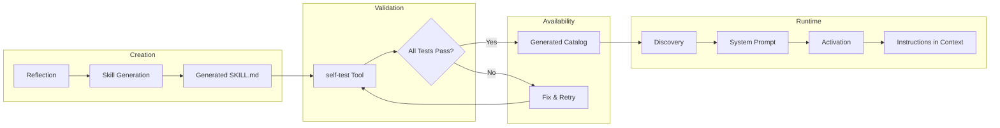

# Plan: Testing Custom Agent Skills in Ouroboros

## Overview

This document describes how to test custom agent skills in Ouroboros across all
levels of the skill lifecycle: discovery, activation, execution, self-testing,
and the full crystallization pipeline.

## Skill Lifecycle



## 1. Unit Testing the Skill Manager (Discovery & Activation)

**File:** `packages/cli/tests/tools/skill-manager.test.ts`

The skill manager has comprehensive unit tests already covering:

- **Discovery** — skills found in `core/`, `generated/`, `builtin/`, and legacy/manual staging directories when configured; multi-base-path precedence; deduplication; env var configuration (`OUROBOROS_BUILTIN_SKILLS_DIR`, `OUROBOROS_USER_SKILLS_DIRS`).
- **Frontmatter parsing** — required fields (`name`, `description`), optional fields (`license`, `compatibility`, `metadata`, `references`, `requiresApproval`); YAML sanitization (tab indentation, BOM); invalid YAML rejection.
- **Activation** — full instruction body returned without frontmatter; explicit `references` loading; legacy `REFERENCE.md` heuristic; `fileList` capped at 10 entries per subdirectory; idempotent re-activation (handler fires once).
- **Approval gate** — `requiresApproval: true` denies without handler, activates with approved handler, respects `bypassApproval` flag.
- **Deactivation** — marks skill inactive, errors on unknown names.
- **Tool interface** — `list`, `activate`, `deactivate`, `info` actions; schema validation.

**Key testing patterns:**

- Use temp directories with `beforeEach`/`afterEach` cleanup.
- Helper `writeSkillMd(dir, frontmatter, body)` creates valid `SKILL.md` fixtures.
- `_resetSkills()` / `_resetSkillActivatedHandler()` / `_resetSkillApprovalHandler()` ensure isolation between tests.

### How to write a new skill manager test

```typescript
test('my new feature', () => {
  const skillDir = join(FIXTURES, 'core', 'my-skill')
  writeSkillMd(skillDir, { name: 'my-skill', description: 'Test skill' }, '# Body')
  discoverSkills(['core'], FIXTURES)
  const catalog = getSkillCatalog()
  expect(catalog).toHaveLength(1)
})
```

## 2. Unit Testing the RSI Validate Module (Self-Test Runner)

**File:** `packages/cli/tests/rsi/validate.test.ts`

The `runSkillTests` function executes test scripts found in a skill's `scripts/` directory. Tests cover:

- **Passing/failing TypeScript tests** — `bun test ./scripts/test.ts`
- **Passing/failing Python tests** — `python3 scripts/test.py`
- **Passing/failing Shell tests** — `bash scripts/test.sh`
- **Mixed results** — multiple test files, overall = fail if any single file fails
- **Timeout enforcement** — 30s default, process group kill
- **Glob patterns** — `*.test.ts`, `*.test.py`, `*.test.sh`
- **Missing skill directory / SKILL.md / test files** — graceful error returns

**Key testing pattern:**

```typescript
const skillDir = createSkillDir({
  scripts: {
    'test.ts': `import { describe, test, expect } from 'bun:test'\ndescribe('test', () => { test('ok', () => { expect(true).toBe(true) }) })`,
  },
})
const result = await runSkillTests(skillDir)
expect(result.ok).toBe(true)
expect(result.value.overall).toBe('pass')
```

## 3. Unit Testing Skill Generation (Crystallization)

**File:** `packages/cli/tests/rsi/crystallize.test.ts`

Tests the LLM-driven skill generation pipeline:

- **Reflection** — valid JSON parsing, schema validation, novelty/generalizability thresholds, existing-skill-awareness in prompts, malformed LLM output handling, reasoning model compatibility.
- **Skill generation** — `generateSkill()` produces SKILL.md + scripts/test.ts; `writeSkillToGenerated()` writes to the generated directory; duplicate name rejection.
- **Frontmatter conformance** — agentskills.io spec: `name`, `description`, `license: Apache-2.0`, `metadata.generated`, `metadata.author`, `metadata.version`, `metadata.confidence`, `metadata.source_task`.
- **Observation-based crystallization** — repeated workflow sessions produce proposals with source references; one-off noise filtered out; `crystallize()` end-to-end with observation sessions.
- **Validator helpers** — `validateSkillName` (kebab-case, length), `checkNameUniqueness`, `parseSkillResponse` (3 code blocks), `validateRoundTrip`.
- **Malformed LLM output** — missing blocks, empty response, incomplete blocks.

**Key testing pattern — mock LLM:**

```typescript
function createMockLLM(responseText: string): LanguageModel {
  return {
    specificationVersion: 'v3',
    provider: 'mock',
    modelId: 'mock-model',
    supportedUrls: {},
    doGenerate: async () => ({
      content: [{ type: 'text', text: responseText }],
      finishReason: { unified: 'stop', raw: undefined },
      usage: { inputTokens: 10, outputTokens: 20 },
      warnings: [],
    }),
    doStream: async () => { throw new Error('Not used') },
  } as unknown as LanguageModel
}
```

## 4. Unit Testing the Skill Gen Tool

**File:** `packages/cli/tests/tools/skill-gen.test.ts`

Tests the `skill-gen` tool interface:

- Tool exports (`name`, `description`, `schema`)
- Default execute returns dependency injection error (no LLM)
- `createExecute` with mock LLM writes complete skill to generated
- Rejects `shouldCrystallize: false` reflection records

## 5. Unit Testing the Self-Test Tool

**File:** `packages/cli/tests/tools/self-test.test.ts`

Tests the `self-test` tool interface:

- Tool exports and schema validation
- Execute returns structured pass result for a passing skill test
- Execute returns validation error for missing skill path

## 6. Integration Testing: Agent + Skills

**File:** `packages/cli/tests/integration/agent-skills.test.ts`

Tests the end-to-end flow of skills within the agent loop:

- Skill catalog appears in system prompt after discovery
- Agent activates a skill and receives full instructions
- Skill catalog used during agent task execution (mock model captures system prompt)
- Built-in skills from `OUROBOROS_BUILTIN_SKILLS_DIR` appear in system prompt
- Empty skill directories produce empty catalog (no Skills section)
- Repeated activation returns identical body (idempotent, handler fires once)

**Key testing pattern — capturing system prompt:**

```typescript
let capturedSystemPrompt = ''
const model = createInspectingMockModel((prompt) => {
  capturedSystemPrompt = extractSystemMessage(prompt)
  return [...textBlock('Response'), finishStop()]
})
const agent = new Agent(makeAgentOptions(model, registry, {
  skillCatalogProvider: () => getSkillCatalog(),
}))
await agent.run('Do something')
expect(capturedSystemPrompt).toContain('## Skills')
```

## 7. Integration Testing: Slash Skill Invocation

**File:** `packages/cli/tests/skills/skill-invocation.test.ts`

Tests the `/skill-name` slash command parsing and activation:

- Parsing leading slash skill and stripping token from message
- Normal messages left unchanged
- Reserved `/plan` command preserved for CLI handling
- Unknown slash skills rejected
- `activateSkillForRun` bypasses approval handler (slash IS the approval)
- Disabled skills unavailable to both slash invocation and activation

## How to Test a Custom Skill — Step by Step

### Step 1: Create the skill fixture

```
skills/generated/my-custom-skill/
├── SKILL.md
├── references/
│   └── api-guide.md     (optional)
└── scripts/
    └── test.ts           (required for self-test)
```

**SKILL.md** must have valid frontmatter:

```markdown
---
name: my-custom-skill
description: What this skill does and when to activate it
license: Apache-2.0
metadata:
  author: your-name
  version: "1.0"
---

# My Custom Skill

Detailed instructions for the agent...
```

### Step 2: Write the skill's test script

```typescript
// skills/generated/my-custom-skill/scripts/test.ts
import { describe, test, expect } from 'bun:test'
import { mkdirSync, writeFileSync, readFileSync, rmSync } from 'node:fs'
import { join } from 'node:path'
import { tmpdir } from 'node:os'

describe('my-custom-skill', () => {
  test('SKILL.md has valid frontmatter', () => {
    const skillDir = join(import.meta.dir, '..')
    const content = readFileSync(join(skillDir, 'SKILL.md'), 'utf-8')
    expect(content.startsWith('---')).toBe(true)
    expect(content).toContain('name: my-custom-skill')
    expect(content).toContain('description:')
  })

  test('skill instructions contain required sections', () => {
    // ... parse and assert on body content
  })
})
```

### Step 3: Run the self-test tool

```bash
# Via the tool interface:
self-test { skillPath: "skills/generated/my-custom-skill" }

# Or directly with Bun:
cd skills/generated/my-custom-skill && bun test scripts/test.ts
```

### Step 4: Write unit tests for the skill manager

Add tests to `packages/cli/tests/tools/skill-manager.test.ts` to verify your
skill is discovered, activated, and its references load correctly:

```typescript
test('my-custom-skill is discovered and activates correctly', async () => {
  const skillDir = join(FIXTURES, 'generated', 'my-custom-skill')
  writeSkillMd(skillDir, {
    name: 'my-custom-skill',
    description: 'Test skill',
    references: ['api-guide.md'],
  }, '# Instructions')
  // ... create reference file
  discoverSkills(['generated'], FIXTURES)
  const result = await activateSkill('my-custom-skill')
  expect(result.ok).toBe(true)
})
```

### Step 5: Run the full crystallization pipeline (for generated skills)

If the skill was generated by the RSI pipeline, verify with:

```typescript
// packages/cli/tests/rsi/crystallize.test.ts
const result = await crystallize('Task summary', {
  llm: mockModelReturning(VALID_LLM_OUTPUT),
  observationSessions: [...],
  noveltyThreshold: 0.7,
  existingSkills: getSkillCatalog(),
  skillDirs: { generated, core },
})
expect(result.ok).toBe(true)
expect(result.value.outcome).toBe('generated')
```

## Test File Summary

| Test File | What It Tests |
|---|---|
| `tests/tools/skill-manager.test.ts` | Discovery, frontmatter parsing, activation, approval gate, deactivation, tool interface |
| `tests/rsi/validate.test.ts` | Self-test runner: script execution, timeouts, file discovery |
| `tests/rsi/crystallize.test.ts` | Reflection, skill generation, observation-based proposals, validators |
| `tests/tools/skill-gen.test.ts` | Skill-gen tool interface and execution |
| `tests/tools/self-test.test.ts` | Self-test tool interface and execution |
| `tests/tools/crystallize.test.ts` | Crystallize tool interface and config validation |
| `tests/integration/agent-skills.test.ts` | Agent + skills end-to-end: system prompt, activation, built-in skills |
| `tests/skills/skill-invocation.test.ts` | Slash command parsing and activation bypass |
| `tests/tools/reflect.test.ts` | Reflect tool interface |

## Testing Checklist for a New Custom Skill

1. **SKILL.md valid** — frontmatter parses, required fields present, YAML clean
2. **Discovery** — skill found by `discoverSkills` in its directory
3. **Activation** — `activateSkill` returns body without frontmatter
4. **References** — declared references load as content; undeclared files appear in `fileList`
5. **Self-test** — `scripts/test.ts` (or `.py`/`.sh`) passes when run via `self-test` tool
6. **Name uniqueness** — no collision with existing skills in `core/`, `generated/`, or legacy `staging/`
7. **System prompt** — skill appears in catalog after discovery
8. **Approval gate** — if `requiresApproval: true`, approval handler fires correctly

## Running All Skill Tests

```bash
# Full verification (lint + typecheck + CLI tests + desktop E2E)
bun run verify

# Just the CLI tests (includes all skill-related tests)
cd packages/cli && bun test

# Specific skill test files
bun test packages/cli/tests/tools/skill-manager.test.ts
bun test packages/cli/tests/rsi/validate.test.ts
bun test packages/cli/tests/rsi/crystallize.test.ts
bun test packages/cli/tests/integration/agent-skills.test.ts
bun test packages/cli/tests/skills/skill-invocation.test.ts
```
